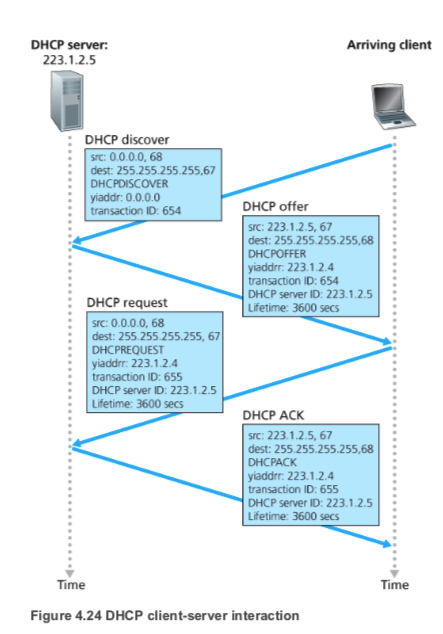
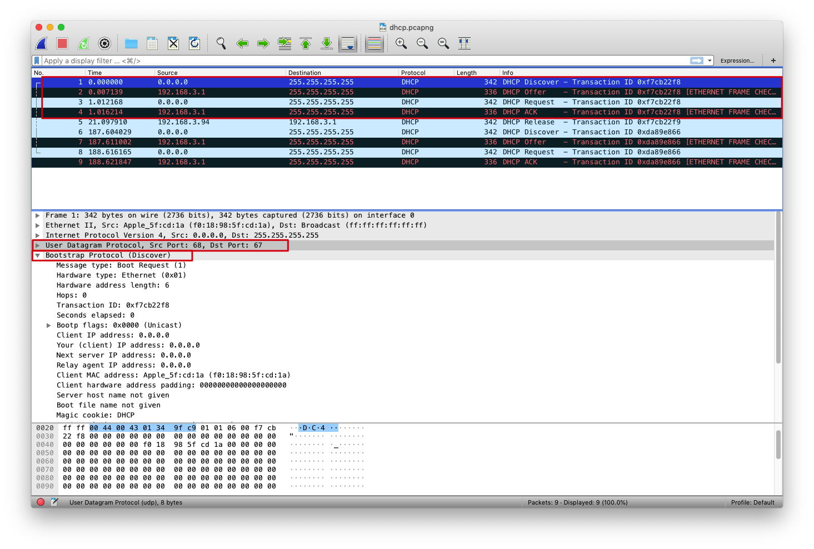
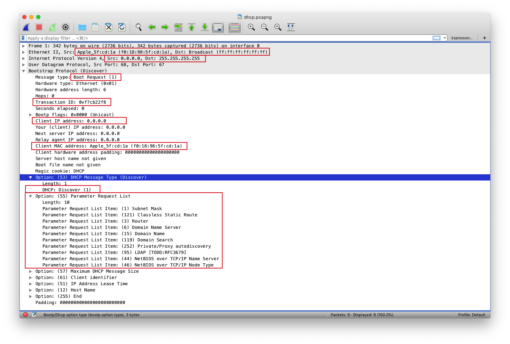
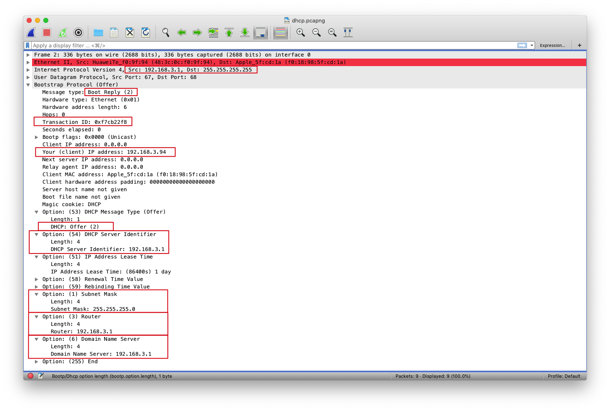
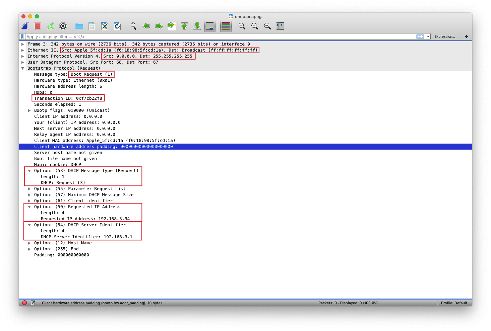
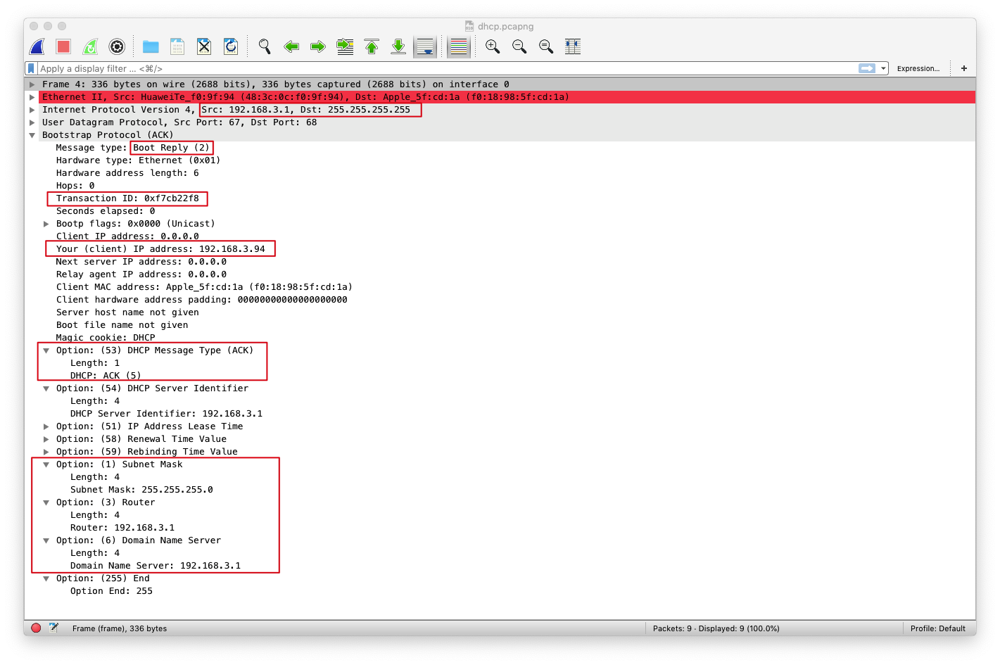
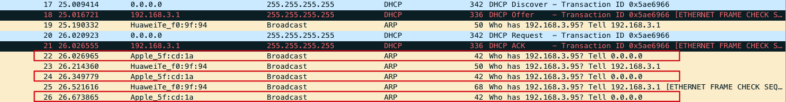
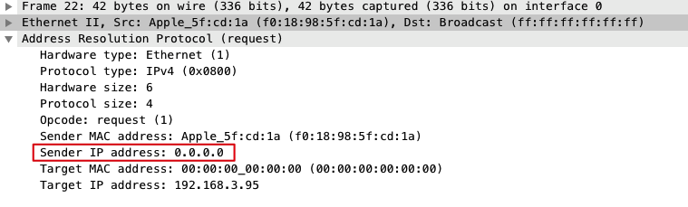
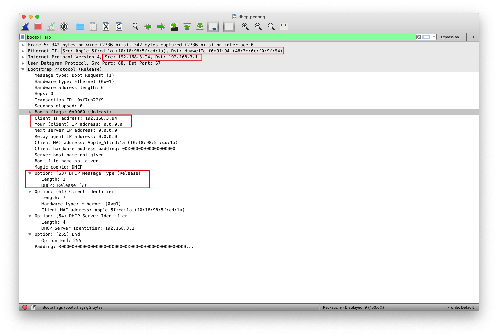

## DHCP

DHCP(Dynamic Host Configuration Protocol) 动态主机配置协议

DHCP协议是一个局域网的网络协议，指的是由服务器控制一段IP地址范围，客户机登录服务器时就可以自动获得服务器分配的IP地址和子网掩码等其他信息

并且DHCP还是一个CS（客户端/服务端）协议。客户通常是新达到的主机，它要获得包括自身使用的IP地址在内的网络配置信息

DHCP CS交互示意图


## Wireshark抓包

首先重置DHCP服务器
``` sh
# windows 
ipconfig /release
# mac
Network preference -> TCP/IP -> Configure IPv4 -> Off
```

接着开启wireshark监听，并请求DHCP服务器分配IP地址
``` sh
# windows
ipconfig /renew
# mac
Network preference -> TCP/IP -> Configure IPv4 -> Using DHCP
```



1. DHCP协议运行在UDP之上，当Client传送给封包给Server时，采用的是UDP **67端口** ，从Server传送给Client则是使用UDP **68端口**
2. UDP下的包裹的是Bootstrap Protocol协议

>DHCP协议是从BOOTP的基础上发展而来的，它们都是主机配置协议，都可以大大减少管理员的工作量。BOOTP可以看成是简单版的DHCP，是对主机的静态配置，而DHCP可以依据一些策略对主机进行动态配置。BOOTP用于无盘工作站的启动和配置，而DHCP更适用于客户端接入变化的网络，即客户端接入时间、接入地点不固定

### DHCP Discover
首先主机会发送一个DHCP(discover)来发现DHCP服务器



1. 因为主机不知道它所连接网络的IP地址，所以使用0.0.0.0来充当本机IP地址（Src:0.0.0.0）
同时主机也不知道该网络的DHCP服务器地址，所以使用 **广播目的地址** 255.255.255.255来充当目的地IP地址（Dst:255.255.255.255），通知这个子网内的设备
2. DHCP类型为1，表示Discover
3. Option字段同时请求了一系列资源，包括子网掩码，DNS服务器地址，路由器地址等
4. 链路层中则使用本机的MAC地址作为源地址（Src:f0:18:98:5f:cd:1a），使用ff:ff:ff:ff:ff:ff作为目的地将这帧广播到这个子网

### DHCP Offer
接着路由器（DHCP服务器）发送DHCP(offer)来提供信息


1. offer报文由路由器（DHCP服务器）发送，IP地址为192.168.3.1 
但是因为此时主机仍然没有IP地址，所以这里还是需要使用 **广播目的地址** 255.255.255.255来充当目的地IP地址，通知这个子网内的设备
2. Your（client）IP address表示路由器（DHCP服务器）提供给主机的ip地址（192.168.3.94）
3. DHCP类型为2，表示Offer
4. Option字段携带推荐资源的信息，包括子网掩码(255.255.255.0)，DNS服务器地址(192.168.3.1)，DHCP服务器地址(192.168.3.1)，路由器地址(192.168.3.1)，IP地址租用期等（如果子网中有多个DHCP服务器，则这些信息不只一组）

### DHCP Request
主机发送DHCP(request)请求ip地址


1. 到现在主机仍然不能确定它所连接网络的IP地址，所以还是只能0.0.0.0来充当本机IP地址（Src:0.0.0.0）
同时因为主机可能会收到很多Offer，而主机在这些Offer中选择了一个后，需要广播一个Request报文，通知这个子网内的所有服务器，这样才能保证IP地址不会冲突
2. DHCP类型为4，表示Request
3. Option字段携带着主机选择好的IP地址和DHCP服务器地址

### DHCP ACK
最后路由器（DHCP服务器）发送DHCP(ACK)给主机，确认信息参数


1. Your（client）IP address表示路由器（DHCP服务器）提供给主机的ip地址（192.168.3.94）
2. DHCP类型为5，表示ACK

### DHCP ARP probe
[RFC 2131](https://tools.ietf.org/html/rfc2131#section-2.2)

在DHCP服务器发送了ACK给主机后，主机还会发送一种特殊类型的ARP报文来检测此时分配给主机的IP是否已经被分配过了，防止在一个子网下有多个IP相同的地址




1. 使用ff:ff:ff:ff:ff:ff作为目的地将这帧广播到这个子网
2. Sender IP address为0.0.0.0是为了防止别的设备更新他们的arp缓存（因为直到此刻还不能最终确定IP地址）
3. Target IP address是DHCP分配给主机的IP地址。如果有别的设备已经使用了这个IP地址，则会发送一个ARP回复报文给主机，表示IP地址冲突

### DHCP Release
当主机不再需要使用分配IP地址时，就会主动向DHCP服务器发送Release报文，告知服务器不再需要分配IP地址给主机，DHCP服务器会释放被绑定的租约



1. 此时Src和Dst的ip地址都已经是确定了的
2. Your IP address:0.0.0.0，表示不再需要分配IP地址给主机
3. DHCP类型为7，表示Release

那么在复杂的网络环境下，如何确定相互通信的客户端和服务端？
观察前四个报文中的Transaction ID，都为0xf7cb22f8，所以客户端和服务端也就是通过这个ID进行通信的

## 参考链接

* Computer Networking - A Top Down Approach, 7th, converted

* https://www.netmanias.com/en/post/techdocs/5999/dhcp-network-protocol/understanding-the-detailed-operations-of-dhcp

* https://www.oreilly.com/library/view/internet-core-protocols/1565925726/ch03s03s02.html#ch03-14446
