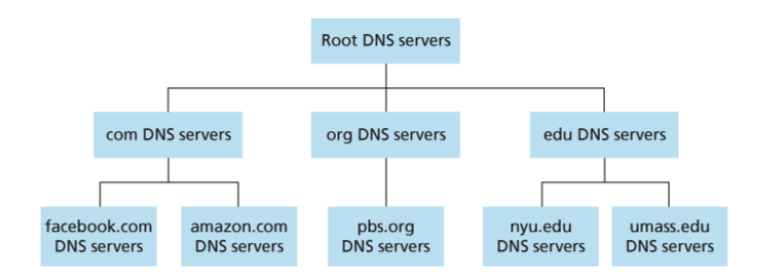
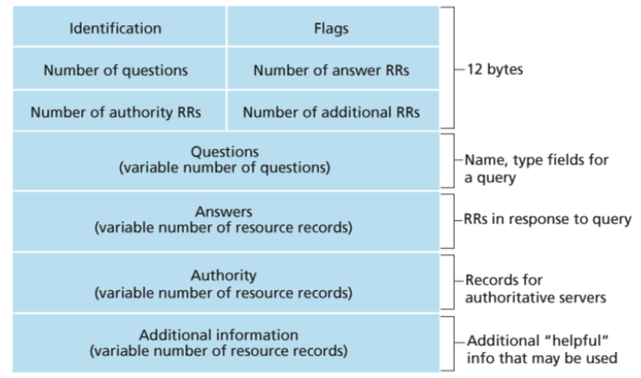
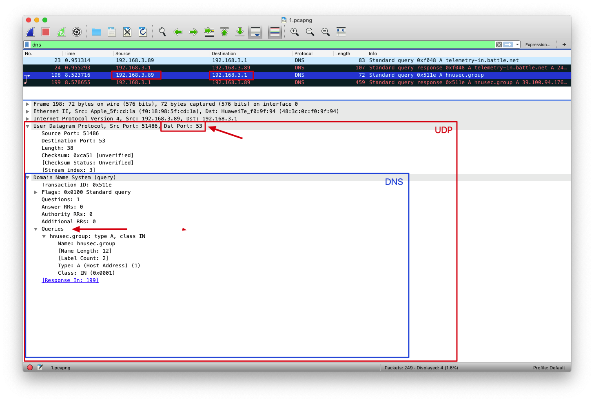
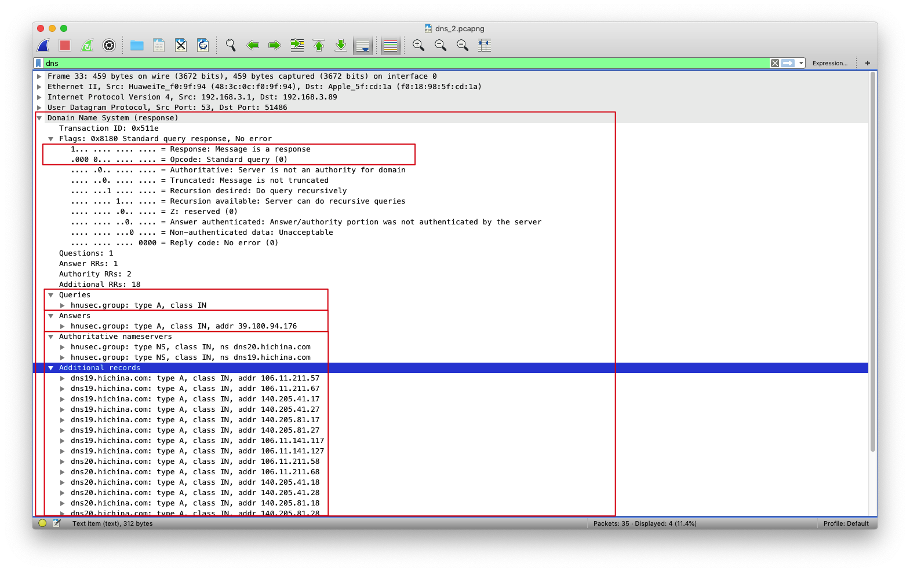
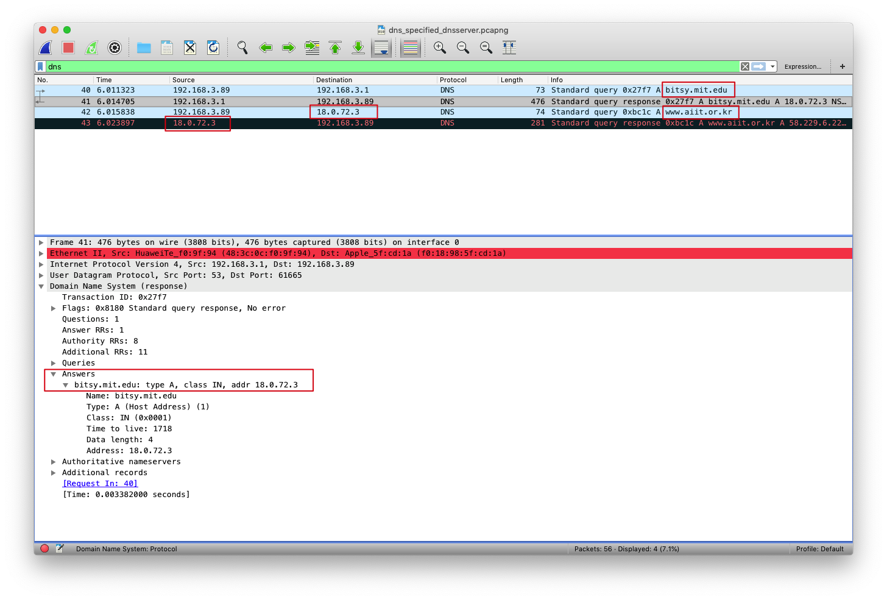

## DNS

DNS(DomainNameSystem) 域名系统（服务）协议

它是应用层协议，主要用于域名与IP地址的相互转换，以及控制因特网的电子邮件的发送

因为在单一DNS服务器上运行集中式数据库完全没有可扩展能力。因此，DNS采用了分布式的设计方案

DNS部分层级结构


DNS

大致说来，有3种类型的DNS服务器:

- 根DNS服务器

- 顶级域 (Top-Level Domain, TLD)DNS服务器

- 权威 DNS 服务器 

### DNS报文

#### DNS报文格式



比较重要的几个字段：

- Flags

    - 1 bit "query/response"：报文是查询报文(0)还是回答报文(1) 

    - 1 bit "Recursion desired"：该DNS服务器没有某记录时是否希望它执行递归查询

    - 1 bit "Recursion available"：是否支持递归查询

- Questions：包含正在进行的查询信息

- Answers：包含对最初请求的名字的资源记录

- Authority：包含其他权威服务器的记录

- Additional information：包含其他有帮助的记录

DNS只有查询和回答报文两种，并且他们拥有 **相同的格式** 

### DNS Types
共同实现 DNS 分布式数据库的所有DNS服务器存储了资源记录 (Resource Record , RR)
资源记录是一个包含了下列字段的 4 元组:
(Name, Value, Type, TTL) 

- 如果 **Type=A** ，则Name是主机名，Value是该主机名对应的IP地址。因此，一条类型为A的资源记录提供了标准的主机名到F地址的映射。例如(relay1.bar.foo.com,145.37.93.126,A)就是一条类型A记录

- 如果 **Type=NS** ，则Name是个域(如foo.com)，而Value是个知道如何获得该域中主机E地址的权威DNS服务器的主机名。这个记录用于沿着查询链来路由DNS查询。例如(f00.com，dns.foo.com,NS)就是一条类型为闸的记录

- 如果 **Type=CNAME** ，则Value是别名为Name的主机对应的规范主机名。该记录能够向查询的主机提供一个主机名对应的规范主机名，例如(foo.com,CNAME)就是一条CNAME类型的记录

- 如果 **Type=MX** ，则Value是个别名为Name的邮件服务器的规范主机名。举例来说，(foo.com,mail.foo.com,MX)就是一条MX记录。MX记录允许邮件服务器主机名具有简单的别名。值得注意的是，通过使用MX记录，一个公司的邮件服务器和其他服务器(如它的Web服务器)可以使用相同的别名。为了获得邮件服务器的规范主机名，DNS客户应当请求一条MX记录;而为了获得其他服务器的规范主机名，DNS客户应当请求CNAME记录


### Wireshark抓包

在抓取dns报文时，我们首先要清理一下本地的dns缓存
``` sh
# mac
sudo killall -HUP mDNSResponder; sleep 2; echo macOS DNS Cache Reset | say
# windows
ipconfig /flushdns
```
同时也要清理浏览器的缓存和数据

查看本机ip及dns服务器
``` sh
# mac
## 查看ip
ifconfig
## 查看dns服务器
cat /etc/resolv.conf

# windows
ipconfig \all
```

使用nslookup作为我们追踪dns的工具
``` sh
nslookup hnusec.group
```
wireshark 过滤规则
``` sh
ip.addr == Your IP && dns
```

#### DNS查询报文



1. DNS协议运行在UDP之上，使用53号端口
2. 查询报文由本机192.168.3.89发送给本地dns服务器192.168.3.1
3. DNS查询报文中有Transaction ID：0x511e，Queries表明要查询的域名hnusec.group（Type A）

#### DNS回答报文



1. Queries的内容与对应的查询报文中Queries是相同的（例如Transaction ID同为0x511e）
2. Answers返回要查询的域名hnusec.group对应的类型（Type A)，IP地址（39.100.94.176）以及其他的一些参数
3. Authoritative nameservers返回域名所对应的权威DNS服务器（dns19.hichina.com, dns20.hichina.com）

与域名解析中分配的DNS服务器是一致的
4. Additional records会返回一些帮助信息，例如这里就返回了这些权威DNS服务器对应的IP地址（一个域名对应多个地址，参考DNS负载均衡）

如果需要指定dns-server，则可以使用下面的命令形式
``` sh
# nslookup domain [dns-server]
nslookup www.aiit.or.kr bitsy.mit.edu
```

可以看到，当指定使用bitsy.mit.edu的dns服务器（18.0.72.3）后，nslookup首先会去本地dns服务器中寻找是否有bitsy.mit.edu的记录如果没有，则首先会发一条对其的dns请求

接着使用获取到的bitsy.mit.edu的ip地址作为dns服务器进行查询（第42条已经将18.0.72.3作为目的地）

最后返回www.aiit.or.kr对于的ip地址