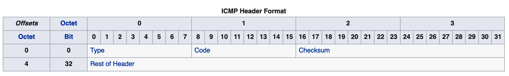
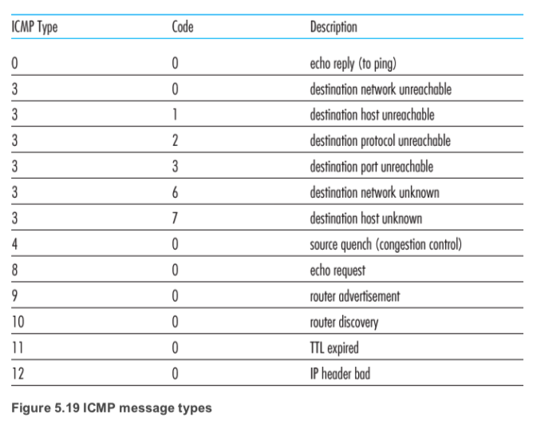
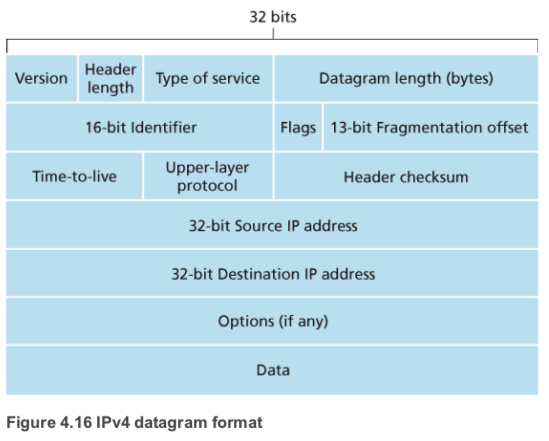

> 本文作者@zww

ICMP（Internet Control Message Protocol）Internet控制报文协议

它是TCP/IP协议簇的一个子协议，用于在IP主机、路由器之间传递控制消息（网络通不通、主机是否可达、路由是否可用等网络本身的消息）

这些控制消息虽然并不传输用户数据，但是对于用户数据的传递起着重要的作用

> ICMP is often considered part of IP, but architecturally it lies just above IP, as ICMP messages are carried inside IP datagrams. That is, ICMP messages are carried as IP payload, just as TCP or UDP segments are carried as IP payload. Similarly, when a host receives an IP datagram with ICMP specified as the upper-layer protocol (an upper-layer protocol number of 1), it demultiplexes the datagram’s contents to ICMP, just as it would demultiplex a datagram’s content to TCP or UDP.
>
> from Computer Networking - A Top Down Approach, 7th, converted

从上文可以看出ICMP是在IP协议之上的，也就是说ICMP是被IP报文包裹的，就跟UDP或者TCP报文一样

### ICMP报文格式

**ICMP报文头格式**


**ICMP报文数据段**
> ICMP error messages contain a data section that includes a copy of the entire IPv4 header, plus at least the first eight bytes of data from the IPv4 packet that caused the error message. The maximum length of ICMP error messages is 576 bytes. This data is used by the host to match the message to the appropriate process. If a higher level protocol uses port numbers, they are assumed to be in the first eight bytes of the original datagram's data.
>
> from Wikipedia

ICMP报文的数据段包括一整个IPv4头的内容，并加上最少头八个字节的IPv4数据包内造成错误信息的数据

**ICMP类型**

这边主要可以关注一下Type 0, Type 8, Type 11这三种类型的ICMP报文，下面会提及到

### IPv4报文格式



这里着重介绍一下TTL（Time-to-live)，它指定了数据包最多能经过几次路由器
从我们源主机发出去的数据包在到达目的主机的路上要经过许多个路由器的转发，在发送数据包的时候源主机会设置一个TTL的值，每经过一个路由器TTL就会被减去一，当TTL为0的时候该数据包会被直接丢弃（不再继续转发），并发送一个超时ICMP报文给源主机，这也就是Traceroute的原理

### Wireshark抓包

这里选用Traceroute中ICMP回复包作为例子进行分析


可以看到IPv4数据报分为Header和Data两个段，Header依照IPv4的格式存储IPv4的各种参数，Data则存储ICMP的整个报文数据
接下来我们看一下IPv4 Data段


可以看到ICMP全部的报文是包裹在IPv4 Data内的，并且ICMP报文的Header中标明了ICMP的消息类型(Type和Code)，Data则表明了引起错误的IPv4数据包内的数据

## Traceroute 

### 命令及参数

```sh
$ traceroute

Version 1.4a12+Darwin
Usage: traceroute [-adDeFInrSvx] [-A as_server] [-f first_ttl] [-g gateway] [-i iface]
	[-M first_ttl] [-m max_ttl] [-p port] [-P proto] [-q nqueries] [-s src_addr]
	[-t tos] [-w waittime] [-z pausemsecs] host [packetlen]
``` 

### 原理

#### 基于UDP

如果tracereoute不指定参数，则默认使用的是UDP模式进行数据包的发送
traceroute会选择一个大于30000的端口作为目的ip的接收端口进行发送，服务器在收到这个数据包的时候会返回一个端口不可达的ICMP错误信息，客户端通过判断收到的错误信息是TTL超时还是端口不可达（按照type）来判断数据包是否到达目标主机

流程图: 


* 客户端发送一个TTL为1，端口号大于30000的UDP数据包，到达第一站路由器之后TTL被减去1，返回了一个超时的ICMP数据包，客户端得到第一跳路由器的地址
* 客户端发送一个TTL为2的数据包，在第二跳的路由器节点处超时，得到第二跳路由器的地址
* 客户端发送一个TTL为3的数据包，数据包成功到达目标主机，返回一个端口不可达错误，traceroute结束

因为traceroute默认的发包数为3，所以每个TTL时长都会发送三次，接收回来的ICMP数据包也为三个（如果超过了一定的时长就认为是不可达了，用 **\*** 表示），也就是为什么每个ip地址后都会跟着三个时间了

**traceroute:**


**wireshark:**


通过箭头颜色的指示可以看到
1. 每次都会有三个相同地址的ip返回给我本机的ip:192.168.3.83，也就印证了traceroute默认每个TTL都会发包3次
2. TTL每次都会递增1

但是在traceroute的过程中，有可能遇到了traceroute不能到达目的地的问题，这里可以考虑一个情况是大多数服务器都不会提供UDP服务，或者是被防火墙给挡掉了，所以收不到服务器的任何返回，导致超时，TTL继续增加

当然我们有别的方法可以试图去解决这个问题

#### 基于ICMP

回去看traceroute给我们的指南，可以看到一个-P参数，这个-P参数可以指定发送报文的协议

因为当前的ip是可以ping的通的，所以可以尝试一下使用icmp协议（ping使用的就是icmp协议进行）

流程图:


使用icmp协议
``` sh
traceroute -P icmp xiaolab.net
```


可以看到，虽然收到了两跳的超时，但是第21跳就可以收到目的地发过来的ICMP超时错误了

**wireshark**

这一次使用的就是icmp作为请求数据包，类型为Type 8 (Echo (ping) request)，也就是使用ping工具发送的数据包了
其余的原理则与UDP相同

## 参考链接

* https://www.jianshu.com/p/75a5822d0eec
