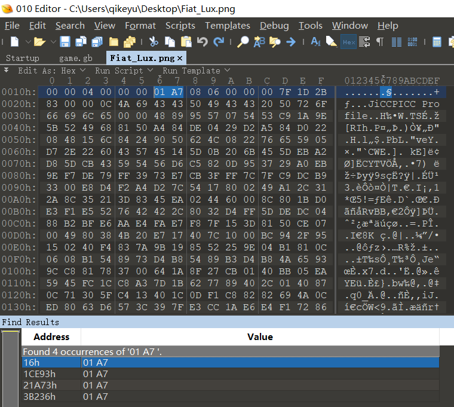

# Misc类——png

下载图片后发现图片下部缺了一个小角，想到可能是改变了图片的高来隐藏图片大小

查看图片属性，图片规格为1024*423

进制转换后得到423的十六进制形式为01A7，1024的十六进制形式为0400

准备工作完成

用010Editor打开图片

搜索01A7，在第一处发现前面还有一个“0400”确定这里是图片的高，将01A7改为0400后保存图片，再打开，拿到flag