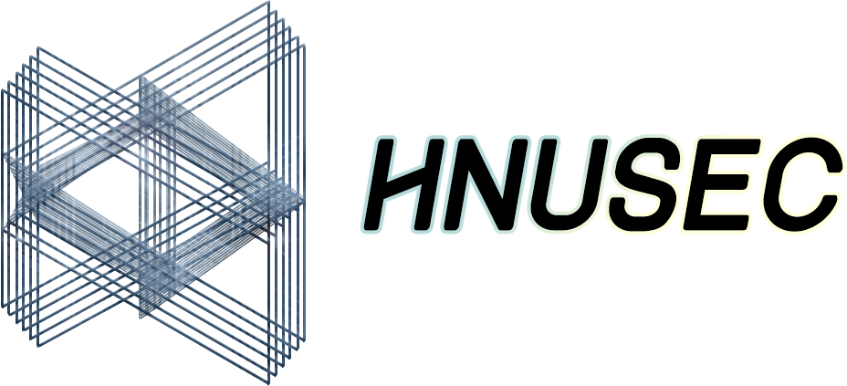

# Welcome to HNUSEC Wiki

欢迎来到 **HNUSEC Wiki**

HNUSEC Wiki是由 **湖南大学信安协会** 所搭建的Wiki平台

内容包括但不限于 **课程资料** ，**专业技能** ，**CTF知识** ，**论文导读** ，以及各种 **有趣的** 文章，公众号

在这里，你可以找到很多你需要的东西，不免也会发现很多新奇事物

加油！让我们一起成长和进步

## Before reading

初生的Wiki需要你的血液，我们在这里欢迎所有想要 **贡献词条** 的小伙伴！

详情发送邮件至978078524@qq.com

本Wiki平台基于[MkDocs](https://www.mkdocs.org/), [Material for MkDocs](https://squidfunk.github.io/mkdocs-material/)和[CTF Wiki](https://ctf-wiki.github.io/ctf-wiki/)

## Material color palette 颜色主题

### Primary colors 主色

> 默认 `white`

点击色块可更换主题的主色

<button data-md-color-primary="red">Red</button>
<button data-md-color-primary="pink">Pink</button>
<button data-md-color-primary="purple">Purple</button>
<button data-md-color-primary="deep-purple">Deep Purple</button>
<button data-md-color-primary="indigo">Indigo</button>
<button data-md-color-primary="blue">Blue</button>
<button data-md-color-primary="light-blue">Light Blue</button>
<button data-md-color-primary="cyan">Cyan</button>
<button data-md-color-primary="teal">Teal</button>
<button data-md-color-primary="green">Green</button>
<button data-md-color-primary="light-green">Light Green</button>
<button data-md-color-primary="lime">Lime</button>
<button data-md-color-primary="yellow">Yellow</button>
<button data-md-color-primary="amber">Amber</button>
<button data-md-color-primary="orange">Orange</button>
<button data-md-color-primary="deep-orange">Deep Orange</button>
<button data-md-color-primary="brown">Brown</button>
<button data-md-color-primary="grey">Grey</button>
<button data-md-color-primary="blue-grey">Blue Grey</button>
<button data-md-color-primary="white">White</button>

### Accent colors 辅助色

> 默认 `red`

点击色块更换主题的辅助色

<button data-md-color-accent="red">Red</button>
<button data-md-color-accent="pink">Pink</button>
<button data-md-color-accent="purple">Purple</button>
<button data-md-color-accent="deep-purple">Deep Purple</button>
<button data-md-color-accent="indigo">Indigo</button>
<button data-md-color-accent="blue">Blue</button>
<button data-md-color-accent="light-blue">Light Blue</button>
<button data-md-color-accent="cyan">Cyan</button>
<button data-md-color-accent="teal">Teal</button>
<button data-md-color-accent="green">Green</button>
<button data-md-color-accent="light-green">Light Green</button>
<button data-md-color-accent="lime">Lime</button>
<button data-md-color-accent="yellow">Yellow</button>
<button data-md-color-accent="amber">Amber</button>
<button data-md-color-accent="orange">Orange</button>
<button data-md-color-accent="deep-orange">Deep Orange</button>

